# Agent World 实现文档索引 + 依赖 DAG

> 综合 `ref/AGENT_WORLD_PROJECT_LAYOUT.md` v0.3 + 10 个 subagent 各自的 impl 文档。
> 本文是**实现顺序的导航图**：每条边 `A → B` 表示"实现 B 必须先实现 A"（即 B 依赖 A）。
> 与 LAYOUT §8 的开发阶段（P-1 ~ P7）对齐，但更细粒度（按文档而非模块）。

---

## 0. 文档总览（44 份 + 1 模板）

| 域 | 文档 |
|---|---|
| **模板** | `_TEMPLATE.md` |
| **world/** 编排 | `world_state.md`, `world_step.md`, `world_clock.md` |
| **world/** 数据态 | `world_place_store.md`, `world_relation_graph.md`, `world_capability_table.md`, `world_connectivity.md`, `world_registrars.md` |
| **world/** 感知/分发 | `world_perception.md`, `world_dispatcher.md` |
| **buses/** | `bus_face_to_face.md`, `bus_remote_message.md`, `bus_group_message.md` |
| **pools/** | `pools_manager.md`, `pools_platform_factory.md` |
| **script/** | `script_engine.md`, `script_registrars.md`, `script_triggers.md`, `script_effects.md`, `script_loader.md` |
| **memory/** | `memory_updater.md`, `memory_manager.md`, `memory_translator.md`, `memory_retrieval.md`, `memory_segment.md`, `memory_compressor.md` |
| **persistence/** | `persistence_world_db.md`, `persistence_pool_db.md`, `persistence_schema_world.md`, `persistence_schema_pool.md` |
| **vendor/oasis/ fork** | `fork_oasis_platform.md`, `fork_oasis_typing.md`, `fork_oasis_database.md`, `fork_oasis_recsys.md`, `fork_oasis_agent.md`, `fork_oasis_agent_action.md`, `fork_oasis_agents_generator.md`, `fork_oasis_schema.md` |
| **agents/** 扩展 | `agents_dynamic_tools_and_profile.md` |
| **app + 周边** | `app_services.md`, `app_api.md`, `ipc_layer.md`, `runner.md`, `config_layer.md` |

---

## 1. 依赖 DAG（Mermaid）

> 节点 = impl 文档；边 `A --> B` 表示 **B 的实现读取 A 中定义的 API/schema**。
> 颜色分组按域划分；DAG 已分层（同一层内可并发动手）。

```mermaid
graph TD
    %% ============ L0: 叶子 ============
    subgraph L0["L0 · 叶子（零依赖）"]
        clock[world_clock]
        wreg[world_registrars]
        sreg[script_registrars]
        ftyp[fork_oasis_typing]
        fsch[fork_oasis_schema]
        wsch[persistence_schema_world]
        ipc[ipc_layer]
        capi[app_api]
        cfg0[/conscribe lib/]:::ext
    end

    wreg --> cfg0
    sreg --> cfg0

    %% ============ L1 ============
    subgraph L1["L1 · 基础设施"]
        wdb[persistence_world_db]
        fdb[fork_oasis_database]
        psch[persistence_schema_pool]
        frec[fork_oasis_recsys]
        ps[world_place_store]
        rg[world_relation_graph]
        ct[world_capability_table]
        strig[script_triggers]
        seff[script_effects]
        mtran[memory_translator]
        mret[memory_retrieval]
    end

    wsch --> wdb
    fsch --> fdb
    fsch --> psch
    fsch --> frec
    wdb --> ps
    wdb --> rg
    wdb --> ct
    wreg --> ps
    wreg --> rg
    wreg --> ct
    sreg --> strig
    sreg --> seff
    ftyp --> mtran

    %% ============ L2 ============
    subgraph L2["L2 · 组合层"]
        pdb[persistence_pool_db]
        conn[world_connectivity]
        sload[script_loader]
        fplat[fork_oasis_platform]
        atools[agents_dynamic_tools_and_profile]
        mseg[memory_segment]
        mupd[memory_updater]
        mman[memory_manager]
        cfg[config_layer]
    end

    psch --> pdb
    fdb --> pdb
    ps --> conn
    rg --> conn
    ct --> conn
    sreg --> sload
    strig --> sload
    seff --> sload
    ftyp --> fplat
    fdb --> fplat
    frec --> fplat
    fsch --> fplat
    ftyp --> atools
    ct --> atools
    conn --> atools
    mtran --> mseg
    ftyp --> mseg
    mtran --> mupd
    mupd --> mman
    sreg --> cfg
    wreg --> cfg

    %% ============ L3 ============
    subgraph L3["L3 · 业务子系统"]
        bf2f[bus_face_to_face]
        brdc[bus_remote_message]
        bgrp[bus_group_message]
        pfac[pools_platform_factory]
        seng[script_engine]
        mcomp[memory_compressor]
        faact[fork_oasis_agent_action]
        asvc[app_services]
    end

    wdb --> bf2f
    ps --> bf2f
    conn --> bf2f
    clock --> bf2f
    wdb --> brdc
    ps --> brdc
    conn --> brdc
    rg --> brdc
    ct --> brdc
    clock --> brdc
    wdb --> bgrp
    ps --> bgrp
    conn --> bgrp
    clock --> bgrp
    fplat --> pfac
    fdb --> pfac
    frec --> pfac
    pdb --> pfac
    sload --> seng
    sreg --> seng
    strig --> seng
    seff --> seng
    wdb --> seng
    mseg --> mcomp
    mtran --> mcomp
    mman --> mcomp
    mupd --> mcomp
    ftyp --> faact
    wdb --> asvc
    pdb --> asvc
    ipc --> asvc

    %% ============ L4 ============
    subgraph L4["L4 · 顶层装配"]
        pman[pools_manager]
        wper[world_perception]
        wdis[world_dispatcher]
        wsta[world_state]
        fagent[fork_oasis_agent]
        fgen[fork_oasis_agents_generator]
    end

    pfac --> pman
    frec --> pman
    ps --> pman
    ct --> pman
    conn --> pman
    ps --> wper
    rg --> wper
    ct --> wper
    conn --> wper
    wdb --> wper
    mret --> wper
    seng --> wper
    pman --> wper
    bf2f --> wdis
    brdc --> wdis
    bgrp --> wdis
    pman --> wdis
    seng --> wdis
    mcomp --> wdis
    mseg --> wdis
    wdb --> wdis
    ps --> wsta
    rg --> wsta
    ct --> wsta
    clock --> wsta
    pman --> wsta
    wdb --> wsta
    ftyp --> fagent
    faact --> fagent
    atools --> fagent
    wper --> fagent
    fagent --> fgen
    atools --> fgen

    %% ============ L5 ============
    subgraph L5["L5 · 主循环 + 入口"]
        wstep[world_step]
        run[runner]
    end

    wsta --> wstep
    clock --> wstep
    ps --> wstep
    wdis --> wstep
    wper --> wstep
    seng --> wstep
    mcomp --> wstep
    mseg --> wstep
    pman --> wstep
    bf2f --> wstep
    brdc --> wstep
    bgrp --> wstep
    wdb --> wstep
    fagent --> wstep
    fgen --> wstep
    asvc --> run
    ipc --> run
    cfg --> run
    wstep --> run
    capi --> asvc

    classDef ext fill:#eee,stroke:#999,stroke-dasharray:3 3,color:#666;
```

---

## 2. 分层实现阶段表

> 同一层内**可并发动手**；跨层必须串行。
> 与 LAYOUT §8 P-阶段映射在最右列（部分文档跨多 P）。

### L0 · 叶子（共 7 份 + 模板）— 零依赖，先建

| 文档 | 内容 | LAYOUT P 对应 |
|---|---|---|
| `world_clock.md` | OASIS `clock/clock.py` KEEP 原样 | P-1 |
| `world_registrars.md` | `world/_registrars.py`：3 个 Registrar Base（relation/capability/place）+ Path A metaclass | P0~P3 共用 |
| `script_registrars.md` | `script/_registrars.py`：EffectBase/TriggerBase + Path A metaclass | P4 准备 |
| `fork_oasis_typing.md` | ActionType enum 净增 5（删 LISTEN_FROM_GROUP + 新增 6） | P-1 fork |
| `fork_oasis_schema.md` | OASIS schema/ 删 3 群聊 + user.sql/rec.sql 修正 | P-1 fork |
| `persistence_schema_world.md` | 12 张 world.db DDL（含 group_event 第 12 张 + direct_message 含 arrive_at/attempted_at/delivered） | P0 |
| `app_api.md` | Flask 路由表 + 入口骨架 | 任意（与内核解耦） |
| `ipc_layer.md` | CommandType enum + 文件 IPC 协议 | 与 P0 并行 |

### L1 · 基础设施（11 份）— 依赖 L0

| 文档 | 关键依赖（L0/L1） | LAYOUT P |
|---|---|---|
| `persistence_world_db.md` | `persistence_schema_world` | P0 |
| `fork_oasis_database.md` | `fork_oasis_schema` | P-1 |
| `persistence_schema_pool.md` | `fork_oasis_schema` | P3 |
| `fork_oasis_recsys.md` | `fork_oasis_schema`（user.sql 修正） | P3 |
| `world_place_store.md` | `world_registrars`, `persistence_world_db` | P0 |
| `world_relation_graph.md` | `world_registrars`, `persistence_world_db` | P1 |
| `world_capability_table.md` | `world_registrars`, `persistence_world_db` | P2 |
| `script_triggers.md` | `script_registrars` | P4 |
| `script_effects.md` | `script_registrars` | P4（StateChange 是 v0.3 新） |
| `memory_translator.md` | `fork_oasis_typing` | P5 |
| `memory_retrieval.md` | （独立；调 `zep_tools.quick_search`） | P5 |

### L2 · 组合层（9 份）— 依赖 L0/L1

| 文档 | 关键依赖 | LAYOUT P |
|---|---|---|
| `persistence_pool_db.md` | `persistence_schema_pool`, `fork_oasis_database` | P3 |
| `world_connectivity.md` | `world_place_store`, `world_relation_graph`, `world_capability_table` | P1（4 个 φ） |
| `script_loader.md` | `script_registrars`, `script_triggers`, `script_effects` | P4 |
| `fork_oasis_platform.md` | `fork_oasis_typing`, `fork_oasis_database`, `fork_oasis_recsys`, `fork_oasis_schema` | P3 |
| `agents_dynamic_tools_and_profile.md` | `fork_oasis_typing`, `world_capability_table`, `world_connectivity` | P2（dynamic_tools）+ P0/P5（profile 6 字段） |
| `memory_segment.md` | `memory_translator`, `fork_oasis_typing` | P5 |
| `memory_updater.md` | `memory_translator` | P5 |
| `memory_manager.md` | `memory_updater` | P5 |
| `config_layer.md` | `script_registrars`, `world_registrars`（conscribe 生成 schema） | 与 P0~P4 滚动跟进 |

### L3 · 业务子系统（8 份）— 依赖 L2

| 文档 | 关键依赖 | LAYOUT P |
|---|---|---|
| `bus_face_to_face.md` | `persistence_world_db`, `world_place_store`, `world_connectivity`, `world_clock` | P0 |
| `bus_remote_message.md` | 上 + `world_relation_graph`, `world_capability_table` | P1（含 arrive_at + delay） |
| `bus_group_message.md` | `persistence_world_db`, `world_connectivity`, `world_place_store`, `world_clock` | P6（含 group_event + 持久队列重投） |
| `pools_platform_factory.md` | `fork_oasis_platform`, `fork_oasis_database`, `fork_oasis_recsys`, `persistence_pool_db` | P3 |
| `script_engine.md` | `script_loader`, `script_*`, `persistence_world_db` | P4 |
| `memory_compressor.md` | `memory_segment`, `memory_translator`, `memory_manager`, `memory_updater` | P5（v0.3 必做） |
| `fork_oasis_agent_action.md` | `fork_oasis_typing`（API 通过 platform_manager.dispatch） | P0~P4 滚动加 6 method |
| `app_services.md` | `persistence_world_db`, `persistence_pool_db`, `ipc_layer` | 与全程并行 |

### L4 · 顶层装配（6 份）— 依赖 L3

| 文档 | 关键依赖 | LAYOUT P |
|---|---|---|
| `pools_manager.md` | `pools_platform_factory`, `fork_oasis_recsys`, `world_place_store`, `world_capability_table`, `world_connectivity` | P3 |
| `world_perception.md` | `world_*` 数据态、`persistence_world_db`、`memory_retrieval`、`script_engine`、`pools_manager` | P0（最小） → P1~P6 增量补 |
| `world_dispatcher.md` | 三 Bus、`pools_manager`、`script_engine`、`memory_compressor`、`memory_segment`、`persistence_world_db` | P0~P6 滚动；UPDATE_STATE/MOVE hook 在 P4/P5 |
| `world_state.md` | 全部 4 个 store + `world_clock`、`pools_manager`、`persistence_world_db` | P0 |
| `fork_oasis_agent.md` | `fork_oasis_typing`, `fork_oasis_agent_action`, `agents_dynamic_tools_and_profile`, `world_perception` | P0（4 段 prompt 接 perception） + P2（per-step 工具） |
| `fork_oasis_agents_generator.md` | `fork_oasis_agent`, `agents_dynamic_tools_and_profile` | P0~P3（与 profile 同步） |

### L5 · 主循环 + 入口（2 份）— 顶点

| 文档 | 关键依赖 | LAYOUT P |
|---|---|---|
| `world_step.md` | **几乎所有 L0~L4** —— micro-tick 11 步串起内核 | P0（最小骨架） → P1~P6 增量 |
| `runner.md` | `app_services`, `ipc_layer`, `config_layer`, `world_step` | P4 起跑 |

---

## 3. 关键依赖路径（对照 LAYOUT §8 P 阶段）

### P-1 路径（fork OASIS 上线即可跑）
`fork_oasis_typing` ∥ `fork_oasis_schema` → `fork_oasis_database`

### P0 路径（最小可演示：多 agent 在 2 地点说话）
`persistence_schema_world` → `persistence_world_db` → `world_place_store` ∥ `world_clock` → `world_state` → `bus_face_to_face` → `world_perception (min)` → `fork_oasis_agent (4 段 prompt)` → `world_dispatcher (min)` → `world_step (min micro-tick)`

### P1 路径（RDC + coverage + B9 失败透传）
`world_relation_graph` ∥ `world_capability_table` → `world_connectivity` → `bus_remote_message` → `world_perception` 增 obs.recent_failed_attempts → `world_dispatcher` 加 SEND_MESSAGE/RELATION_CHANGE 路由

### P2 路径（capability 失能后工具消失）
`agents_dynamic_tools_and_profile (dynamic_tools)` → `fork_oasis_agent` 改 per-step 工具

### P3 路径（多池推荐独立运行）
`fork_oasis_recsys` → `fork_oasis_platform` → `persistence_schema_pool` → `persistence_pool_db` → `pools_platform_factory` → `pools_manager`

### P4 路径（YAML 剧本准时触发 + UPDATE_STATE）
`script_registrars` → `script_triggers` ∥ `script_effects` → `script_loader` → `script_engine` → `world_dispatcher` 加 REQUEST_MOVE/UPDATE_STATE 路由 → `runner` 起跑

### P5 路径（Zep 三层灌注 + MOVE 触发摘要）
`memory_translator` → `memory_segment` ∥ `memory_updater` → `memory_manager` → `memory_compressor` → `world_dispatcher` 加 MOVE pre-hook → `world_step` 步骤 9

### P6 路径（群聊 + group_event + 持久队列重投）
`bus_group_message` → `world_perception` 加 obs.group_events → `world_step` 步骤 5 sweep + `fork_oasis_agent_action` 4 个群聊 method 路由

### P7 路径（跨池镜像 + 星际 30 tick 延迟）
`pools_manager` 加 R-Mirror 钩子 → `bus_remote_message` 实测 latency_ticks 大值场景

---

## 4. 跨层注意事项

1. **`world_dispatcher.md`、`world_perception.md`、`world_step.md`、`fork_oasis_agent.md` 是"滚动迭代"**：P0 写最小版，P1~P6 持续增补。请实现时把它们当作"**长生命周期文档**"持续维护，而不是一次写死。

2. **`world_step.md` 是终极聚合**：依赖几乎所有 L0~L4 节点。P0 阶段先实现"轮初+micro-tick(只F2F)+轮末"骨架，后续 P1~P6 把 RDC/GRP sweep / pool update / script due / compressor on_move / Zep flush 一步步插入对应位置（11 步流水线）。

3. **`config_layer.md`、`app_services.md`、`app_api.md`、`ipc_layer.md`、`runner.md` 与内核**：可与 P0 并行启动（外壳来自 MiroFish COPY），但 IPC 4 个新命令需等对应 P 阶段才能 wire 通（INJECT_SCRIPT_EVENT/RELOAD_SCRIPTS 等 P4；MOVE_AGENT 等 P0）。

4. **`fork_oasis_*.md` 8 份是**底层 EDIT 改动**：`fork_oasis_typing` / `fork_oasis_schema` 在 P-1 一次性改完；`fork_oasis_platform` / `fork_oasis_database` / `fork_oasis_recsys` 在 P3 改完；`fork_oasis_agent` / `fork_oasis_agent_action` / `fork_oasis_agents_generator` 滚动到 P0~P5。

5. **`persistence_schema_*.md` 是 DDL 真相源**：`persistence_world_db.md` / `persistence_pool_db.md` 启动期 `executescript` 时引用。schema 调整时这 4 份要联动改。

6. **`memory_compressor.md` 是 v0.3 新增 MVP 必做项**（不再延后到 post-MVP）；其 fail/timeout 不阻断主循环，原 raw segment 保留下次 MOVE 重试。

7. **重叠节点（多个文档共有）**：`world_dispatcher` 既是 L4 的"装配根"也被 `bus_*` / `pools_manager` / `memory_compressor` 反向 hook（B4 retry / MOVE pre-hook 等）；DAG 中表现为 `bus_* → wdis` 与 `wdis → bus_*` 同时存在的部分循环——按"先实现 stub，后填路由"打破：dispatcher 先暴露 dispatch(action) 的接口骨架，三个 Bus 各自实现完毕后，再把路由表填进 dispatcher。

---

## 5. 相对来源仓库的高层归类

| 类别 | 文档数量 | 备注 |
|---|---|---|
| **NEW（全新写）** | 18 | world/* 全部、buses/* 全部、pools/* 全部、script/* 全部、memory/{segment,compressor,retrieval,translator}、persistence/{world_db, schema_world}、config_layer |
| **EDIT（fork 直接改）** | 8 | `fork_oasis_*.md` 全部 |
| **COPY/ADAPT MiroFish** | 6 | `app_services` / `app_api` / `ipc_layer` / `runner` / `memory_updater` / `memory_manager` |
| **混合（NEW + KEEP）** | 6 | `world_clock`(KEEP) / `persistence_pool_db`(KEEP OASIS create_db + NEW 投影) / `persistence_schema_pool`(KEEP 13 张 + 删 3 张) / `agents_dynamic_tools_and_profile`(NEW dynamic_tools + ADAPT MiroFish profile) / `world_registrars`(NEW + 依赖 conscribe lib) / `script_registrars`(同) |
| **模板** | 1 | `_TEMPLATE.md` |
| **总计** | 44 + 1 模板 | 与 LAYOUT §2.A~§2.I + §4 + §5 全覆盖 |

---

*本文是文档级 DAG（非代码级 DAG）；实际开发时 LAYOUT §8 的 P-阶段切片更适合按周排期。*
